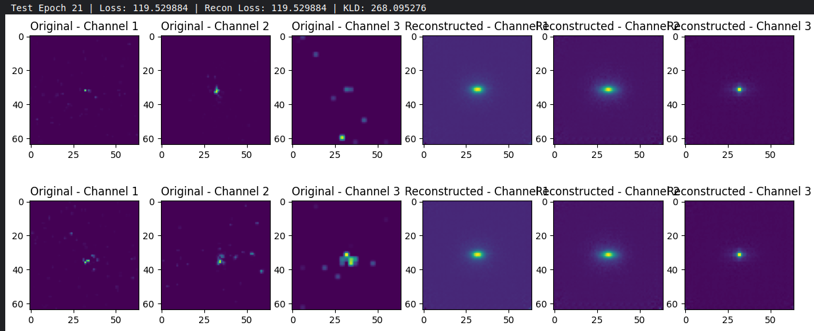
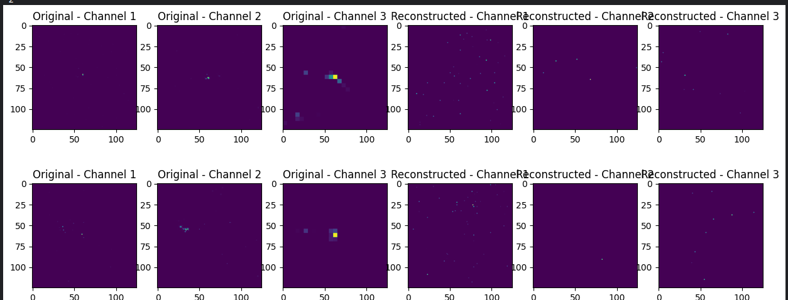

## Model Architecture

1. The model is an encoder-decoder VAE with convolutional layers in both the encoder and decoder, and linear layers for the mean and log variance outputs.
2. A combination of reconstruction loss and KL divergence loss for a Gaussian prior was used to train the model.
3. The decoder used transposed convolution layers to reconstruct the input from the latent representation.
4. Experiments with different model depths and output activation functions (e.g., ReLU, Leaky ReLU) were conducted.

## Data Preprocessing

1. Data was extracted and placed as a dataset on Kaggle for training.
2. Images were resized to either 128x128 or 64x64 for faster computation and efficient memory usage.
3. Min-max normalization was applied to scale pixel values between 0 and 1.
4. Training was performed on a subset of the dataset, using between 10,000 and 60,000 samples.

## Experiments

1. Various reconstruction loss functions were tested, including:
    - Mean Squared Error (MSE)
    - Weighted MSE (to increase importance of regions with higher activity)
    - Multi-Scale Structural Similarity Index (MSSIM)
    - Weighted MSE + MSSIM
2. The latent space size was varied across experiments, with values ranging from 16 to 256.
3. Beta-VAE experiments were performed, where the KL divergence term was weighted using a β factor to encourage disentanglement.
4. Beta schedulers were implemented to gradually increase the β value during training.
5. Different convolutional layer depths were experimented with to balance model complexity and reconstruction quality.

## Inferences

1. Using a weighted MSE loss resulted in better reconstructions by reducing the influence of zero-valued pixels.
2. A latent space size of 64 to 128 provided the best trade-off between reconstruction accuracy and model complexity.
3. The reconstructions tended to be noisy regardless of the loss function used, indicating a limitation of the VAE or data format. Hence it is better to shift to a graph based dataset and utilizing GNNS for the task.
4. The model often produced reconstructions that were mean representations of the input data (bright regions at the centre with noise arouund it) showing that the model was not able to learn any meaningful representation of the datapoinst regardless of any other factors(model complexity, latent size etc..).
5. A linear beta schedule did not really help in improving perfromance as the initialy the reconstruction would improve but then the model would collapse to a mean representation and the KLD would increase rapidly indicating that the latent representation being learned is not meaningful and the reconstruction loss would then plateau and remain constant.
6. Applying any activation to the final output did not create any positive effects. ReLU and LeakyReLU caused very sparse reconstructions (model was not really learning), sigmoid also did not make any major improvements to the reconstruction and KLD loss hence it was best to keep the final layer output without any activation. 
7. Further tuning of the β factor(cyclic β scheduler), using advanced loss functions might help mitigate the noise and improve reconstruction quality.

## Reconstructions
VAE reconstruction without any final activation: 

VAE reconstruction with final activation as ReLU: 

