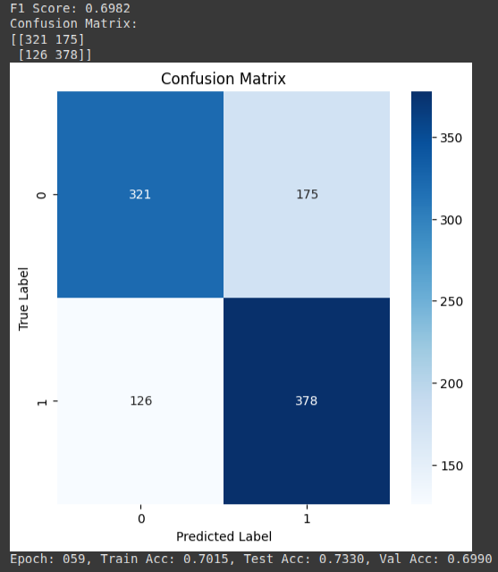

## Graph Construction

1. Graph features were constructed using the ecal, hcal, and tracks features (only for cases where at least one of them is non-zero) provided for each data point, along with the normalized coordinates. These coordinates were then used in the k-Nearest Neighbors (kNN) method to construct the graph edges, which were tested with various values of k.
2. Only a subset of the data (~10,000 - 20,000) was used in the training of the classification model.

## Model Architecture

1. In each model, global features were appended after pooling, including m0 and pt features.
2. Binary Cross Entropy (BCE) loss was used for training.
3. A model with 3 GNN layer with global pooling followed by 4 Linear layers was used for teh classification task. 

## Additional Experiments

- Various layers were tested in the model architecture (GraphSAGE, GAT and GCN) for classification..
- Model performance was compared with and without using global features.

## Inference and Observations

1. The accuracy of each model, except SAGEConv, increased with higher k values but does not vary by much.
2. The maximum recorded accuracy was 71.8% using the GAT-Classifier after 60 epochs.GCN and GAT may often outperform SAGEConv because GCN efficiently aggregates neighborhood information using spectral convolutions, while GAT uses attention mechanisms to focus on the most relevant neighbors, leading to better feature representation. SAGEConv, though more scalable, may lack the adaptivity and expressiveness needed for accurate reconstruction.

## Performance Comparison(Global Features)

| \( k \) | SAGEConv (%) | GCN (%) | GAT (%) |
|----------|--------------|----------|---------|
| 2        | 71.20        | 69.60    | 71.30   |
| 5        | 71.30        | 70.00    | 70.90   |
| 10       | 69.60        | 71.00    | 71.80   |

F1 Score and confusion matrix of one of the models. 
