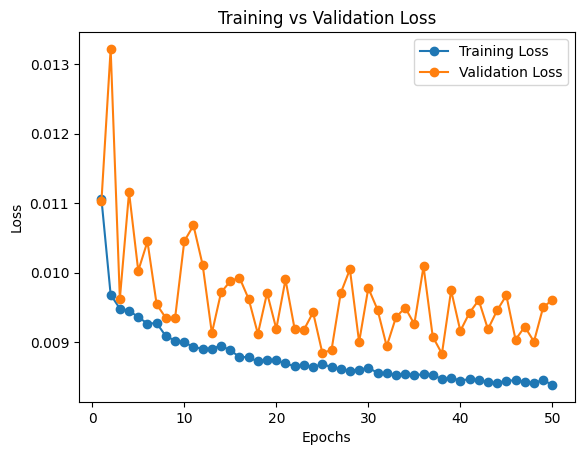
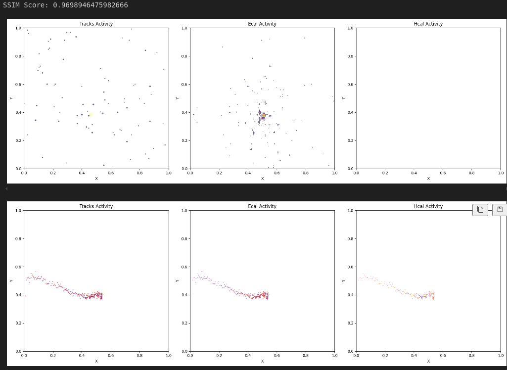
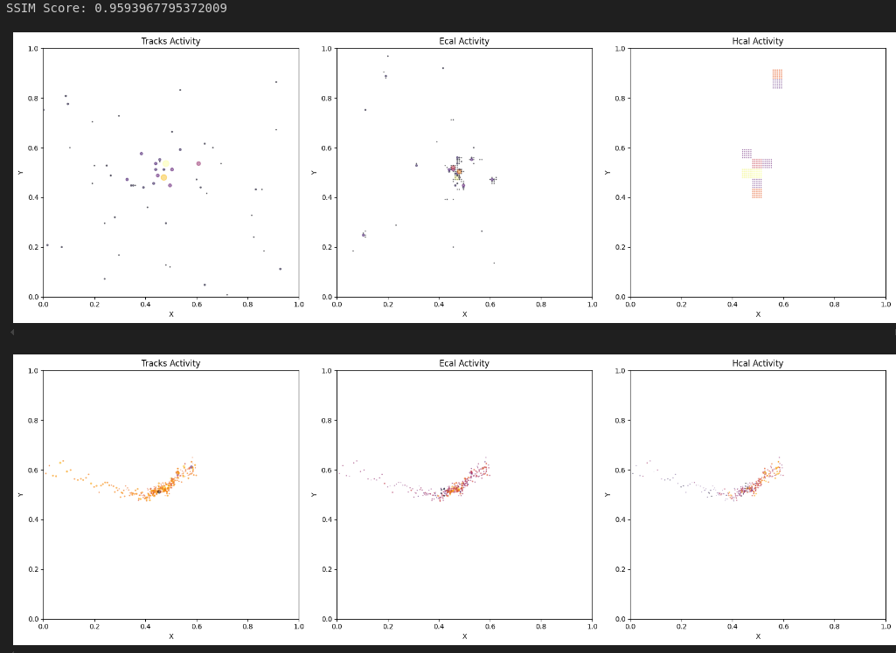

## Architecture  

1. An encoder-decoder model was used, with the encoder consisting of graph convolution or attention layers (GAT, GCN, or SAGEConv) and the decoder comprising linear layers.  
2. The model outputs the reconstructed features for a maximum number of nodes.  
3. A reconstruction loss for the features, with masking applied to the first \( n \) nodes in a graph, was used as the primary loss function.  

## Data Preprocessing  

1. Only points with non-zero values in at least one of the three channels (ecal, hcal, or tracks) were used as nodes in the graph, along with normalized coordinates as additional features.  
2. The graph was constructed using the k-Nearest Neighbor (kNN) method, based on the coordinates of the nodes.  
3. Nodes were sorted based on their coordinates to establish a canonical ordering of nodes.  

## Experiments  

- Varying the types of layers in the model encoder, including GAT, GCN, and SAGEConv.  
- Adjusting the latent dimension of the model to analyze its effect on reconstruction quality.  
- Applying weighted channel losses for MSE to emphasize non-zero channels during reconstruction.  

## Observations and Inferences  

1. The model faced challenges in accurately reconstructing node features for graphs with varying node counts.  
2. Increasing the k value improved reconstruction quality by providing more context for each node, but this also led to denser graphs, making learning more complex.  
3. Coordinate-based sorting effectively simplified the loss calculation since a graph matching algorithm was not needed.  
4. Masking-based loss contributed to stable training across graphs with different sizes by focusing on the most relevant nodes.  
5. However, the canonical ordering introduced artifacts, notably a horizontal line of points. This occurred because the model learned the sorted ordering, and the mask consistently selected the first \( n \) nodes.  
6. Structural Similarity Index Measure (SSIM) was used as the evaluation metric to assess the reconstruction quality, providing insight into how well the spatial structures were preserved.  

## Training Loss Curve

The plot below shows the training loss over the epochs, indicating how well the model converges during training.

---

## Reconstruction Results

The following image compares the original graphs with their reconstructions generated by the model. Visual inspection highlights the effectiveness of the model in capturing spatial structures.

